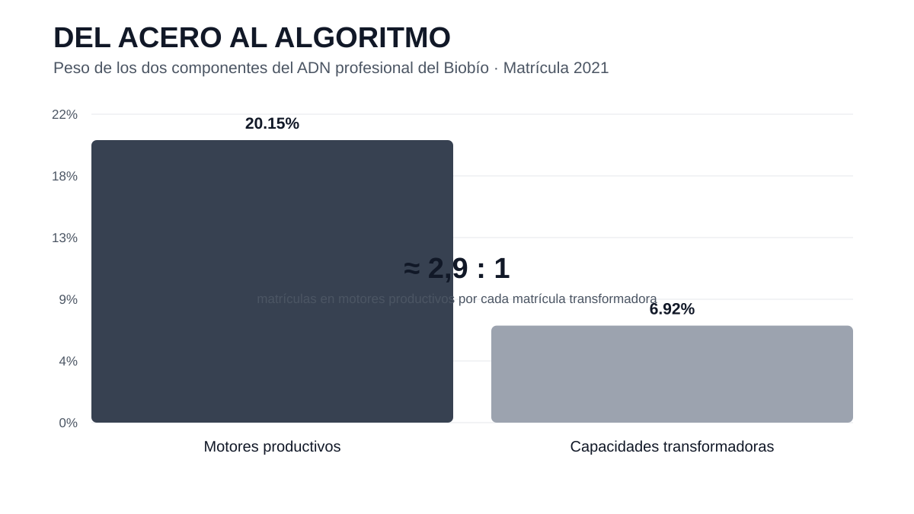
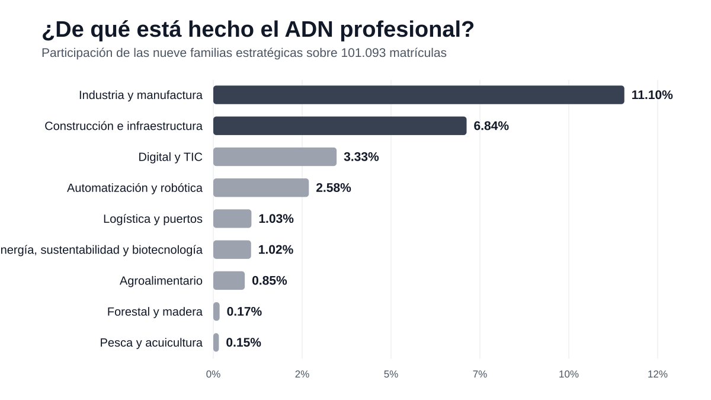
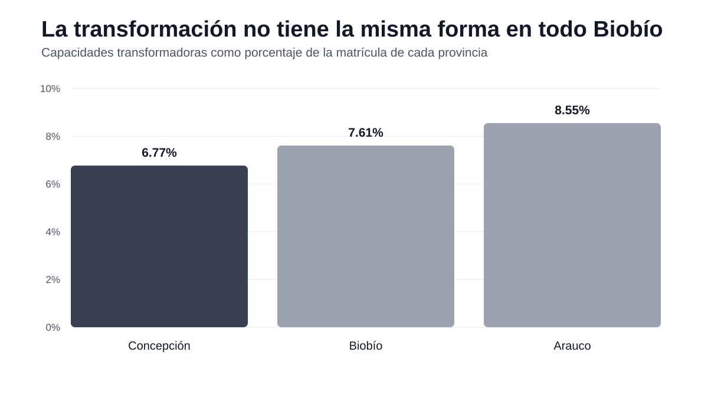

# Estadística descriptiva

# **DEL ACERO AL ALGORITMO**
## *¿Desde qué base de talento parte el Biobío que quiere avanzar hacia la Industria 4.0?*

## Idea central

El proyecto compara dos componentes del capital humano formado en la educación superior del Biobío durante 2021:

### “Acero”: motores productivos
- Industria y manufactura
- Construcción e infraestructura
- Logística y puertos
- Forestal y madera
- Pesca y acuicultura
- Agroalimentario

### “Algoritmo”: capacidades transformadoras
- Digital y TIC
- Automatización y robótica
- Energía, sustentabilidad y biotecnología

La comparación se conecta con la agenda regional posterior de manufactura avanzada, tecnologías digitales e Industria 4.0.

## Pregunta guía
**En la fotografía educativa de 2021, ¿qué peso tenía la formación ligada a los motores productivos tradicionales frente a las capacidades necesarias para transformarlos tecnológicamente?**

## Hallazgo principal

Sobre **101.093 matrículas de pregrado**:

- Motores productivos: **20.350 matrículas, 20,14%**.
- Capacidades transformadoras: **7.000 matrículas, 6,93%**.
- Relación aproximada: **2,9 matrículas en motores productivos por cada matrícula transformadora**.

En otras palabras, el componente formativo asociado al “acero” era casi tres veces el componente asociado al “algoritmo”.

## Por qué importa

El Gobierno Regional y Corfo han impulsado una transición desde manufactura tradicional hacia manufactura avanzada e Industria 4.0, con tecnologías digitales, innovación y capital humano avanzado.

Por eso la base 2021 se interpreta como una **línea base educativa** desde la cual observar esa transformación.

Esto **no demuestra un déficit laboral** ni permite afirmar que la educación esté cambiando más lento que la industria. Para eso harían falta datos de empleo, vacantes, salarios y una serie temporal.

## Causas plausibles
- Herencia productiva regional: una gran base industrial y manufacturera genera históricamente una oferta formativa asociada a esos sectores.
- Transformación tecnológica más reciente: digitalización, automatización, IA y manufactura avanzada están siendo fortalecidas como parte de una nueva etapa productiva.

## Riesgo regional que plantea el trabajo
Si la demanda futura por capacidades digitales y automatizadas creciera más rápido que la formación disponible, podrían aparecer dificultades de adopción tecnológica, dependencia de talento externo o menor capacidad para agregar valor.

Ese riesgo se presenta como **hipótesis de investigación**, no como efecto probado por el notebook.

## Hallazgos secundarios
- Industria y manufactura: **11,10%** de la matrícula.
- Digital y TIC: **3,33%**.
- Automatización y robótica: **2,58%**.
- Energía, sustentabilidad y biotecnología: **1,02%**.
- Mujeres en Digital y TIC: **11,50%**.
- Mujeres en Automatización y robótica: **5,79%**.

## Estado
- ✅ Notebook corregido y ejecutado previamente.
- ✅ Preguntas obligatorias 1, 2 y 3 preservadas.
- ✅ Clasificación de motores productivos y capacidades transformadoras implementada.
- ✅ Nuevo relato “Del acero al algoritmo” incorporado.
- ✅ Causas, consecuencias plausibles y límites metodológicos documentados.
- ✅ Notebook reestructurado siguiendo el estilo de desarrollo usado por el profesor.
- ✅ Ejecución completa validada con el Excel real: **51/51 celdas de código sin errores**.
- ✅ Gráfico principal **Acero vs Algoritmo** incorporado al notebook.
- ✅ Tres gráficos narrativos guardados en `graficos/`.
- ⏳ Rehacer la presentación con este único relato.
- ⏳ Preparar defensa oral.

## Fuentes regionales de contexto
- GORE Biobío, Centro Tecnológico de Manufactura Avanzada e Industria 4.0: https://gorebiobio.cl/wp-content/uploads/2025/10/18.-Ord.-3310-GORE.pdf
- CORFO, Centro Tecnológico de Manufactura Avanzada e Industria 4.0 en Biobío: https://postulaciones.corfo.cl/sites/Satellite?c=C_NoticiaNacional&cid=1476741161258&d=Touch&pagename=CorfoPortalPublico%2FC_NoticiaNacional%2FcorfoDetalleNoticiaNacionalWeb
- GORE Biobío, Capital Humano Avanzado en Inteligencia Artificial: https://gorebiobio.cl/2023/10/18/gobierno-regional-del-biobio-lanza-el-primer-doctorado-en-inteligencia-artificial-de-sudamerica/

## Regla de trabajo del repositorio
Este repositorio es la **fuente oficial del proyecto**. Cada cambio debe quedar guardado en GitHub.

## Gráficos del nuevo relato
- `graficos/acero_vs_algoritmo.svg`: contraste principal 20,15% vs 6,92%.
- `graficos/familias_adn_profesional.svg`: composición de las nueve familias estratégicas.
- `graficos/transformacion_por_provincia.svg`: peso relativo de capacidades transformadoras por provincia.

## Historia visual

## Estilo de desarrollo del notebook
El notebook fue reorganizado tomando como referencia los laboratorios resueltos del profesor:

- pregunta o actividad claramente escrita;
- código corto y visible;
- resultado inmediatamente después;
- interpretación en una celda Markdown;
- uso directo de pandas y matplotlib;
- tablas de frecuencia con groupby().size();
- frecuencias relativas calculadas de forma explícita;
- gráficos construidos con fig, ax = plt.subplots();
- media, mediana, desviación estándar y coeficiente de variación calculados paso a paso;
- conclusiones descriptivas sin atribuir causalidad.

La creatividad queda en el problema regional **“Del acero al algoritmo”**, mientras que la forma de resolver estadísticamente sigue el nivel y la estructura utilizados en clases.

## Alineación final con los laboratorios del profesor
- ✅ Se eliminó la frecuencia acumulada de `AREA CONOCIMIENTO` porque es una variable cualitativa nominal.
- ✅ Las medidas de dispersión quedaron en **rango, desviación estándar y coeficiente de variación**, como en el Laboratorio 5.
- ✅ Se eliminaron del desarrollo principal la varianza y el RIC.
- ✅ La clasificación “Del acero al algoritmo” dejó de usar búsquedas complejas con `str.contains()` y ahora usa listas + `isin()`, herramienta que aparece en los laboratorios.
- ✅ La pregunta Edad × Institución dejó de usar `pd.crosstab()` y ahora se desarrolla con `groupby()`, frecuencias absolutas y relativas.
- ✅ La pregunta de aranceles sustantivamente altos usa **Percentil 90** como criterio simple y defendible.
- ✅ Validación local con el Excel real: **51/51 celdas de código ejecutadas, 0 errores**.
- ✅ Notebook principal actualizado en `notebooks/Estadistica_Descriptiva_Biobio.ipynb`.
